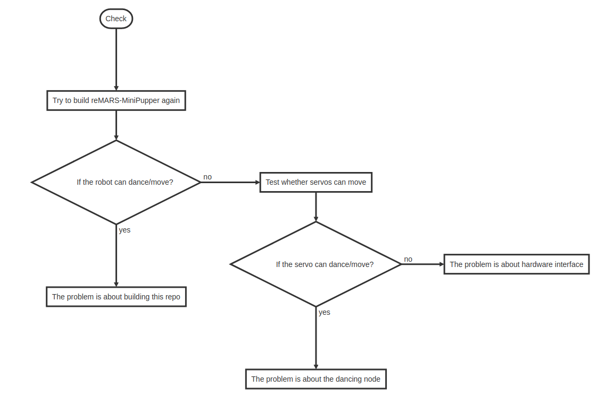

# What I've found

I have tested the following commands on a new empty RPI image with only Ubuntu20.04, ROS Noetic installed. After executing these commands to build the repository you mentioned([reMARS-MiniPupper](https://github.com/mangdangroboticsclub/reMARS-MiniPupper)), the robot can dance itself without any problems. And I have checked and found there's actually no problem with **velocity_smoother**. So, I think there's some problems related to your robot's hardware. I suggest you to try these commands to build this repository one more time, and if the robot still can't move, you should check whether all the servos could move.




# Commands to Build reMARS-MiniPupper

* Install **minipupper_ros_bsp**

```sh
cd ~
git clone https://github.com/0nhc/minipupper_ros_bsp.git
cd ~/minipupper_ros_bsp/mangdang
sudo sh install.sh
sudo reboot
```

* Install **dancing node**

```sh
cd ~
mkdir environment
cd environment
git clone https://github.com/mangdangroboticsclub/reMARS-MiniPupper.git
cd ~/environment/reMARS-MiniPupper/robot_ws
catkin_make
```

* **Test** dancing node

```sh
#Terminal 1
source /opt/ros/melodic/setup.bash
source ~/reMARS-MiniPupper/robot_ws/devel/setup.bash
roslaunch mini_pupper_dance dance.launch
```

```sh
#Terminal 2
source /opt/ros/melodic/setup.bash
rostopic pub /dance_config std_msgs/String "data: 'demo'"
```

# How to Test the Servos

```sh
source /opt/ros/melodic/setup.bash
source ~/reMARS-MiniPupper/robot_ws/devel/setup.bash
roslaunch servo_interface calibrate.launch
```

Then you can input an angle from 0 to 180, and if there's no problem, the servo will move to the given angle. Remember not to go through all the 12 servos because this will change the calibration file. Just test several (less than 12) servos to check whether the servos can move. If there's no problem, just use **Ctrl+C** to quit the terminal.
