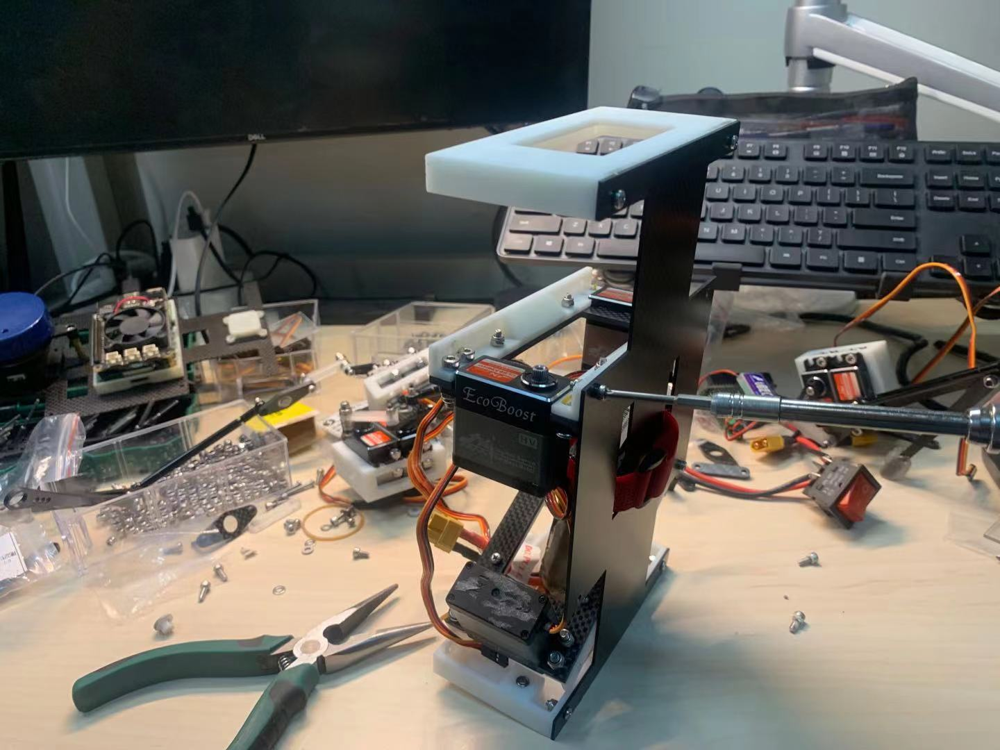

# Introduction to my Robotic Experiences

This page is about my robotic experiences in details. I've been an enthusiast in robotics since I was a kid. I also have bilibili and Twitter account with my robotics related daily life. 

[bilibili@0nhc](https://space.bilibili.com/435723766?from=search&seid=8150707523279557385&spm_id_from=333.337.0.0) 

[Twitter@serious0nhc](https://twitter.com/serious0nhc) 

## Primary School

I've been playing with robots since I was a kid.  

At that time I was playing LEGO NXT Robotics Kit(EV3 now) and participated in FLL and other competitions in our city. It was all about simple line-tracking tasks. But I formed a basic understanding about sensors and servo motors. 

## High School

After entering high school, I participated in VEX EDR Robotics Competition. 

We were the first VEX team in our high school. Although we didn't got good awards at first, it still made me learn a lot about robotics, especially it was the first time I learned and applied PID algorithm.  

Our team number is 17112B, you can check our ranks on VEX official website. 

[https://www.robotevents.com/teams/VRC/17112B](https://www.robotevents.com/teams/VRC/17112B) 

    
    

Then after participating in two international competitions, we have made our robot very robust and finally got the first prize(Rank 2) in our Province.    

    

## College

At first I was doing some simple Arduino projects on my own out of interest, such as adding brushless turbine on my skateboard using ESC for controlling and making a remote controller based on NRF24L01 and flex sensor so that I can use my finger to control my skateboard remotely. 

### IMU Project

Although I was a fresher, some senior students began to invite me to do some projects. The first big project I made was to trying using an IMU to make a sheath of a pen so that the sheath can recognize what the user is trying to write through the data of IMU. 

Our idea was to integrate the data of the IMU into a trajectory of the end point of the pen and then using PCA to fit a plane where the trajectory lies. After doing this we can get a 2D trajectory. Then we resized this 2D trajectory into standard sized image and then put into Neural Networks trained by MNIST to recognize which number the user is writing. 

    

However this method is not so accurate because the data integrated from IMU has a lot of noise. But it was the first time I learned knowledge about IMU sensor, quaternion, neural networks and coordinate transform. 

    

### Quadruped Robot

Then I became a sophomore. Boston Dynamics' videos was really impressing, so I want to make my own robot dog. Getting started with open sourced projects, I bought Stanford's open source robot dog Pupper. After that I learned about Kinematics of robot dogs and tried to design my own quadruped robot controller. Meanwhile I got familiar with Solidworks and designed my own robot dog and exported URDF files. 

    
    
    

Unlike servo motors, the servo for plane models does not have any feedback and can only be controlled with angle. Thus I can only apply position control algorithms(kinematics) on it. 

However then I found an open source quadruped robot simulation package called [champ](https://github.com/chvmp/champ) which has already wrapped MIT Cheetah's kinematic algorithms in ROS, so I directly wrote hardware interfaces and took this package into use. 

I focused on developing apps in ROS for quadruped robots later. The first step was SLAM and Navigation. MIT's algorithm has already made a kinematic odometry which is based on the movement of every leg. But because of the inaccuracy of servos, the kinematic odometry is not reliable. To solve this, I added odometry data provided by 2D laser scan. Laser scan matcher provided laser odometry, and then I put it into [robot_localization](https://github.com/cra-ros-pkg/robot_localization) to fuse the data from kinematic odometry, laser odometry and IMU to get relatively accurate odometry data. 

So finally I built a SLAM and Navigation system for quadruped robots by using Cartographer and move_base. And the company who sold me Stanford's open source robot Pupper to me contacted me. Then we made a new open source quadruped robot dog together, containing all the apps I made. 

Then we cooperated with OpenCV AI Kit and made some simple demos. Their camera kit contains chips of Intel Movidius Neural Compute Stick, which could offer 4 TOPS computing power. With this, we applied gesture detection and object classification algorithms on our robot(base on Raspberry Pi). 

Finally we began our campaign on Kickstarter and were finally crowd-funded $500,000. 

[Mini Pupper: Open-Source,ROS Robot Dog Kit](https://www.kickstarter.com/projects/336477435/mini-pupper-open-sourceros-robot-dog-kit) 

    

The official code repository is maintained by me. You can see all the detailed information in it. 

[mangdangroboticsclub/minipupper_ros](https://github.com/mangdangroboticsclub/minipupper_ros) 

After this, we cooperated with AWS Cloud. I successfully put our simulation platform into AWS RoboMaker so that people can use Gazebo to develop our robot on Cloud. The next step is to combine AWS IOT hardware so that all the data of our robot can be collected and saved simultaneously on Cloud. This repo is also maintained by me. You can see all the detailed information in it. 

[mangdangroboticsclub/aws-robomaker-mini-pupper-application](https://github.com/mangdangroboticsclub/aws-robomaker-mini-pupper-application) 

This was actually started from my project for National College Student Innovation and Entrepreneurship Competition. So at last I won the first place in college. 

    

### RoboCup@Home China

I also participated in RoboCup@Home China in 2021. 

It was all about developing apps in ROS. We combined many functions such as navigation, mobile manipulator, human feature recognition, voice interaction, pose detection and so on. We successfully finished the task of asking a human to pass the luggage and handle it with robot arm and then follow the human by using pointcloud. But the other task of introducing guest to a host failed because of the voice interaction part. But we successfully made empty seat detection by detecting whether there is human in the location of an image. And we used Baidu's API to achieve human feature detection so that the robot can know which one is the host even the host and the guest changed seat. 

Finally we got the second prize, rank 6. All the code has been uploaded on github. 

[iRobotBHK Robotics Group](https://github.com/BHU-SIE-Robotics-Group) 

    

### Internship in Institute for AI Industry Research(AIR), Tsinghua University

#### ICRA2022 RoboMaster University Sim2Real Challenge

Here I mainly helped with the construction of ICRA2022 RoboMaster University Sim2Real Challenge. 

This competition requires participants to develop all the code in MetaAI's simulation platform Habitat and then the official will apply their code in a real robot with the same scene. I helped to test and construct the official sample code of navigation using RTAB-Map with D435i and Cartographer with 2D Lidar. I also fixed some small bugs of the link between Habitat and ROS. 

Now the conpetition has begun and the official code has released. You can see detailed information here. 
Also, I just got the fourth place in round 1. 

[AIR-DISCOVER/ICRA-RM-Sim2Real](https://github.com/AIR-DISCOVER/ICRA-RM-Sim2Real)
 
[RoboMaster University Sim2Real Challenge](https://air.tsinghua.edu.cn/robomaster/sim2real_icra22.html)
